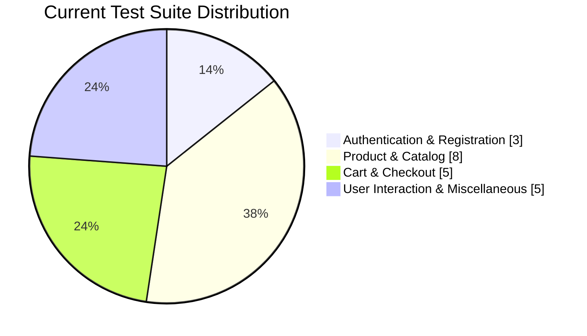

# 🧪 ParaBank Automation Framework

```{=html}
<p align="center">
```
``{=html}
```{=html}
</p>
```
```{=html}
<p align="center">
```
`<strong>`{=html}Web UI Automation Framework built with Selenium
WebDriver, Java, TestNG and Maven`</strong>`{=html}
```{=html}
</p>
```
```{=html}
<p align="center">
```
``{=html}
``{=html}
``{=html}
``{=html}
``{=html}
```{=html}
</p>
```

------------------------------------------------------------------------

## 📌 Project Overview

**ParaBank Automation** is a Selenium-based web automation project
designed to validate critical user journeys of the ParaBank banking
application.

The framework is organized around reusable automation components, TestNG
execution, page/test separation, listeners, and maintainable test
classes. The goal is not merely to click buttons until a green tick
appears, which is apparently how some people define automation, but to
create a structure that can be extended as application coverage grows.

### 🎯 Main Objectives

-   Automate important banking application workflows.
-   Validate functional behavior through repeatable UI tests.
-   Reduce repetitive manual regression effort.
-   Build reusable Selenium utilities and test components.
-   Organize tests so new scenarios can be added with minimal
    duplication.
-   Capture failures and execution evidence where required.
-   Execute the suite consistently through Maven/TestNG.

------------------------------------------------------------------------

## 🏗️ Framework Architecture

``` text
                         ┌──────────────────────────┐
                         │      ParaBank Web App    │
                         └────────────┬─────────────┘
                                      │
                                      ▼
                         ┌──────────────────────────┐
                         │     Selenium WebDriver   │
                         └────────────┬─────────────┘
                                      │
                    ┌─────────────────┴─────────────────┐
                    ▼                                   ▼
          ┌──────────────────┐                ┌──────────────────┐
          │    Page / UI     │                │   Test Classes   │
          │   Interactions   │                │     TestNG       │
          └────────┬─────────┘                └────────┬─────────┘
                   │                                   │
                   └────────────────┬──────────────────┘
                                    ▼
                         ┌──────────────────────────┐
                         │      Assertions /        │
                         │     Validation Logic     │
                         └────────────┬─────────────┘
                                      ▼
                         ┌──────────────────────────┐
                         │ Reports / Screenshots /  │
                         │       Test Results       │
                         └──────────────────────────┘
```

------------------------------------------------------------------------

## 🧰 Technology Stack

  Technology               Purpose
  ------------------------ -------------------------------------------------
  **Java**                 Test automation programming language
  **Selenium WebDriver**   Browser automation
  **TestNG**               Test execution, assertions and suite management
  **Maven**                Dependency and build management
  **Git**                  Version control
  **GitHub**               Source-code hosting and collaboration
  **Chrome / WebDriver**   Browser execution
  **JIRA**                 Defect tracking and test-management workflow

------------------------------------------------------------------------

## 📊 Automation Coverage

The current test suite contains coverage across registration,
authentication, products, cart, checkout, subscriptions and other
functional areas.



> **Note:** The chart represents a high-level classification of the
> current test classes for documentation purposes. It is not a runtime
> test-result percentage.

------------------------------------------------------------------------

## 🧪 Test Scenarios Covered

### 🔐 Authentication & User Management

-   `Login.java`
-   `LogOut.java`
-   `Register.java`

Coverage includes user authentication and account-access workflows.

### 🛒 Product & Catalog

-   `Add_toCart.java`
-   `Product_quantity.java`
-   `Recommended_items.java`
-   `Search_product.java`
-   `View_category.java`
-   `Verify_all_product_page.java`
-   `ViewCartProduct.java`
-   `Review_on_product.java`

These tests validate product discovery, product information, category
navigation, recommendations and cart-related behavior.

### 💳 Cart, Checkout & Orders

-   `Remove_cart.java`
-   `Place_order_Register_checkout...`
-   `verify_subscription_cartPage...`

These scenarios cover cart operations and checkout-related flows.

### 📩 User Interaction & Other Functional Areas

-   `Contact_us.java`
-   `Functionality.java`
-   `Verify_Subscription.java`

These tests cover additional functional workflows and application
behavior.

------------------------------------------------------------------------

## 📁 Project Structure

``` text
Para_Bank/
│
├── src/
│   ├── main/
│   │   └── java/
│   │       ├── base/
│   │       ├── pages/
│   │       ├── utils/
│   │       └── listeners/
│   │
│   └── test/
│       └── java/
│           ├── package_pro/
│           │   ├── Add_toCart.java
│           │   ├── Contact_us.java
│           │   ├── Functionality.java
│           │   ├── LogOut.java
│           │   ├── Login.java
│           │   ├── Place_order_Register_checkout.java
│           │   ├── Product_quantity.java
│           │   ├── Recommended_items.java
│           │   ├── Register.java
│           │   ├── Remove_cart.java
│           │   ├── Review_on_product.java
│           │   ├── Search_product.java
│           │   ├── Verify_Subscription.java
│           │   ├── Verify_all_product_page.java
│           │   ├── ViewCartProduct.java
│           │   └── View_category.java
│           │
│           └── listeners/
│               └── TestListener.java
│
├── test-output/
├── reports/
├── screenshots/
├── pom.xml
├── testng.xml
└── README.md
```

------------------------------------------------------------------------

## ⚙️ Framework Components

### `Base Test`

Centralizes common WebDriver setup and teardown operations.

Typical responsibilities:

-   Browser initialization
-   Application launch
-   Driver configuration
-   Test cleanup
-   Reusable setup logic

### `TestNG`

TestNG is used for:

-   Test execution
-   Assertions
-   Test grouping
-   Suite configuration
-   Data-driven execution where required
-   Listener integration

### `Test Listener`

`TestListener.java` provides a central location for test execution
events.

It can be used to:

-   Detect test failures
-   Capture screenshots
-   Track test status
-   Integrate reporting
-   Improve debugging information

### `Maven`

Maven manages the project's dependencies and provides a consistent
build/execution process.

------------------------------------------------------------------------

## 🔄 Test Execution Flow

``` text
        START
          │
          ▼
   Load Configuration
          │
          ▼
   Initialize WebDriver
          │
          ▼
     Open ParaBank
          │
          ▼
    Execute TestNG Test
          │
      ┌───┴────┐
      │        │
    PASS     FAIL
      │        │
      │        ▼
      │   Capture Evidence
      │        │
      └───┬────┘
          ▼
    Generate Results
          │
          ▼
     Close Browser
          │
          ▼
         END
```

------------------------------------------------------------------------

## ▶️ How to Run the Project

### 1. Clone the repository

``` bash
git clone https://github.com/Jothirupan26/Para_Bank.git
cd Para_Bank
```

### 2. Verify Java

``` bash
java -version
```

Java 21 is used for the current development environment.

### 3. Install dependencies

``` bash
mvn clean install
```

### 4. Execute the TestNG suite

``` bash
mvn test
```

Or execute the configured `testng.xml` file directly from Eclipse /
IntelliJ.

------------------------------------------------------------------------

## 🧩 Example Test Pattern

A typical test follows the structure:

``` java
@Test
public void verifyProduct() {

    WebElement element =
        driver.findElement(By.xpath("//h2[text()='Category']"));

    String text = element.getText();

    Assert.assertTrue(
        text.equalsIgnoreCase("Category")
    );
}
```

The framework focuses on readable locators, explicit validations and
maintainable test logic.

------------------------------------------------------------------------

## ✅ Validation Strategy

The project uses assertions to validate expected application behavior.

### Common validations

-   Element visibility
-   Text verification
-   URL verification
-   Attribute/value verification
-   Navigation validation
-   Product information validation
-   Cart state validation
-   Functional workflow validation

Example:

``` java
Assert.assertTrue(element.isDisplayed());
```

and:

``` java
Assert.assertEquals(actualText, expectedText);
```

The assertion is selected based on what the test actually needs to prove
rather than using `assertEquals` for every problem in existence.
Humanity has suffered enough from that habit.

------------------------------------------------------------------------

## 🐞 Defect & Debugging Approach

When a test fails, the debugging workflow is:

``` text
Test Failure
     ↓
Identify Failed Step
     ↓
Check Locator / Page State
     ↓
Validate Expected vs Actual
     ↓
Capture Screenshot / Logs
     ↓
Reproduce Manually
     ↓
Fix Automation or Report Defect
     ↓
Re-run Regression
```

This helps distinguish between:

-   Automation-script failures
-   Locator problems
-   Synchronization issues
-   Application defects
-   Environment/browser issues

------------------------------------------------------------------------

## 📈 Quality Engineering Focus

This project is being developed with the following QA principles:

  Principle                 Implementation
  ------------------------- ----------------------------------------
  **Repeatability**         Automated TestNG execution
  **Maintainability**       Reusable framework components
  **Traceability**          Clear test names and structured suites
  **Validation**            Assertions against expected behavior
  **Debuggability**         Listener and screenshot support
  **Scalability**           Modular test organization
  **Regression Coverage**   Repeatable functional scenarios

------------------------------------------------------------------------

## 🚀 Future Enhancements

Planned improvements include:

-   [ ] Expand Page Object Model coverage
-   [ ] Improve reusable utility classes
-   [ ] Add stronger data-driven testing
-   [ ] Add explicit wait utilities
-   [ ] Improve Extent reporting
-   [ ] Add parallel TestNG execution
-   [ ] Add CI/CD execution through GitHub Actions
-   [ ] Improve screenshot management
-   [ ] Add environment-specific configuration
-   [ ] Increase regression scenario coverage

------------------------------------------------------------------------

## 📌 Key Learning Outcomes

Through this project, the automation workflow covers:

-   Selenium WebDriver fundamentals
-   Locator strategies
-   XPath
-   Browser automation
-   TestNG annotations
-   Assertions
-   Test listeners
-   Maven project management
-   Reusable automation components
-   Functional testing
-   Regression testing
-   Debugging failed UI tests
-   Git and GitHub workflow

------------------------------------------------------------------------

## 👨‍💻 Author

**Jothirupan**

QA Engineer focused on **Manual Testing and Automation Testing** with
practical experience building Selenium-based test automation projects
using Java, TestNG and Maven.

```{=html}
<p align="center">
```
`<a href="https://github.com/Jothirupan26">`{=html}
``{=html}
`</a>`{=html}
```{=html}
</p>
```

------------------------------------------------------------------------

## ⭐ Project

If this project is useful for learning or understanding Selenium
automation architecture, consider giving the repository a star.

```{=html}
<p align="center">
```
`<strong>`{=html}Built with Java ☕ • Selenium 🧪 • TestNG 🚀 • Maven
🔧`</strong>`{=html}
```{=html}
</p>
```
